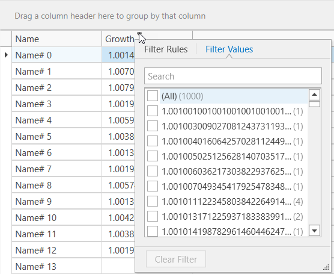
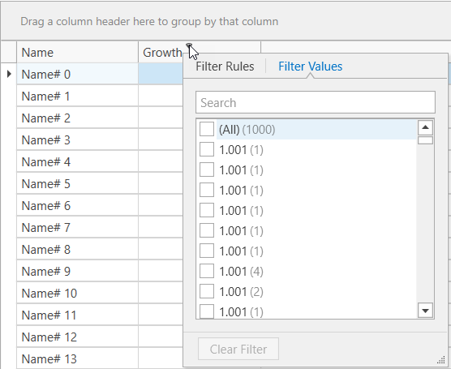
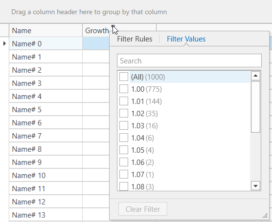

<!-- default badges list -->

[](https://supportcenter.devexpress.com/ticket/details/T1128966)
[](https://docs.devexpress.com/GeneralInformation/403183)
<!-- default badges end -->
# WPF Data Grid - How To Round Decimal Values In Grid Columns

This example demonstrates how to properly round decimal values in GridColumns so that you do not see issues with data management operations (for example, filtering, sorting, and grouping). The most straightforward way to round values in cells is to declare a custom [`DisplayFormat`](https://docs.devexpress.com/WPF/DevExpress.Xpf.Editors.Settings.BaseEditSettings.DisplayFormat). However, this action affects only cells, while GridControl continues to use underlying unrounded values. As a result, you can see duplicated values in Filter DropDown or duplicated group rows.

For example, when the 1.01 and 1.02 values are rounded down to 1.0, they are displayed in the filter popup as separate but indistinguishable options. The images below illustrate whether the [`DisplayFormat`](https://docs.devexpress.com/WPF/DevExpress.Xpf.Editors.Settings.BaseEditSettings.DisplayFormat) is declared or not.

In this image, there is no declared [`DisplayFormat`](https://docs.devexpress.com/WPF/DevExpress.Xpf.Editors.Settings.BaseEditSettings.DisplayFormat) as well as any implemented solution of this example.



In this image, the [`DisplayFormat`](https://docs.devexpress.com/WPF/DevExpress.Xpf.Editors.Settings.BaseEditSettings.DisplayFormat) is declared to display up to three symbols.



To resolve the issue, you need to round values before they are used in GridControl cells. For this, you can use one of the following solutions:

* _Converter._ This example uses the `Binding` property of a column with a converter to round bound values.
* _Unbound_. This example uses non-editable unbound columns.
* _UnboundEditable_. This example uses editable unbound columns.

In this image, you can see the proper filtering of rounded values.



## Implementation details

The _Converter_ solution implements the GridColumn's Binding property to bind it to data. Use a custom converter that rounds values in this Binding definition:

```xml
<dxg:GridColumn Header="Growth"
                Binding="{Binding Growth,
                Converter={StaticResource RoundConverter}, Mode=TwoWay}"/>
```

The _Unbound_ solution implements [unbound expressions](https://docs.devexpress.com/WPF/DevExpress.Xpf.Grid.ColumnBase.UnboundExpression) to round values in columns. This option causes columns to become read-only.

```xml
<dxg:GridColumn Header="Growth" 
                FieldName="GrowthUnbound" 
                UnboundType="Decimal" 
                UnboundExpression="Round([Growth], 2)" 
                ReadOnly="True"/>
```

The _UnboundEditable_ solution implements [`CustomUnboundColumnData`](https://docs.devexpress.com/WPF/DevExpress.Xpf.Grid.GridControl.CustomUnboundColumnData)(code behind) or [`CustomUnboundColumnDataCommand`](https://docs.devexpress.com/WPF/DevExpress.Xpf.Grid.GridControl.CustomUnboundColumnDataCommand)(MVVM) to round values in columns.

```xml
<Grid>
    <dxg:GridControl ItemsSource="{Binding Source}" 
                     CustomUnboundColumnDataCommand="{Binding UnboundColumnDataCommand}">
        <dxg:GridControl.Columns>
            <dxg:GridColumn FieldName="Name"/>
            <dxg:GridColumn Header="Growth"
                            FieldName="GrowthUnbound"
                            UnboundType="Decimal"/>
        </dxg:GridControl.Columns>
    </dxg:GridControl>
</Grid>
```

## Documentation

- [GridControl](https://docs.devexpress.com/WPF/DevExpress.Xpf.Grid.GridControl)
- [Unbound Columns](https://docs.devexpress.com/WPF/6124/controls-and-libraries/data-grid/grid-view-data-layout/columns-and-card-fields/unbound-columns)


## Files to Review
- [MainWindow.xaml](./CS/FilterDuplicateRecords_Converter/MainWindow.xaml)
  
  [RoundConverter.cs](./CS/FilterDuplicateRecords_Converter/RoundConverter.cs)

- [MainWindow.xaml](./CS/FilterDuplicateRecords_Unbound/MainWindow.xaml)
  
  [MainViewModel.cs](./CS/FilterDuplicateRecords_Unbound/MainWindow.xaml.cs)

- [MainWindow.xaml](./CS/FilterDuplicateRecords_UnboundEditable/MainWindow.xaml)
  
  [MainViewModel.cs](./CS/FilterDuplicateRecords_UnboundEditable/MainViewModel.cs)
